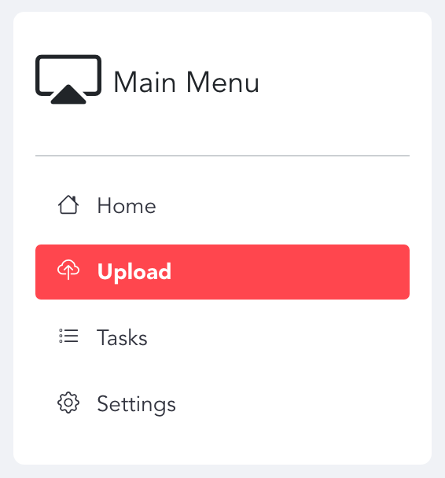
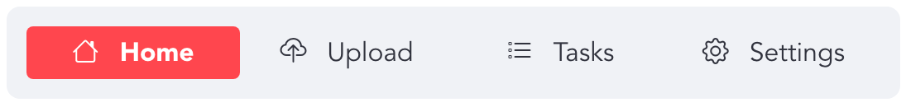
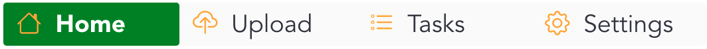

# streamlit-option-menu




streamlit-option-menu is a simple Streamlit component that allows users to select a single item from a list of options in a menu.
It is similar in function to st.selectbox(), except that:
- It uses a simple static list to display the options instead of a dropdown
- It has configurable icons for each option item and the menu title
- The CSS styles of most HTML elements in the menu can be customized (see the styles parameter and Example #3 below)

It is built on [streamlit-component-template-vue](https://github.com/andfanilo/streamlit-component-template-vue), styled with [Bootstrap](https://getbootstrap.com/) and with icons from [bootstrap-icons](https://icons.getbootstrap.com/)

## Installation
```
pip install streamlit-option-menu
```

## Parameters
The `option_menu` function accepts the following parameters:
- menu_title (required): the title of the menu; pass None to hide the title
- options (required): list of (string) options to display in the menu; set an option to "---" if you want to insert a section separator
- default_index (optional, default=0): the index of the selected option by default
- menu_icon (optional, default="menu-up"): name of the [bootstrap-icon](https://icons.getbootstrap.com/) to be used for the menu title
- icons (optional, default=["caret-right"]): list of [bootstrap-icon](https://icons.getbootstrap.com/) names to be used for each option; its length should be equal to the length of options
- orientation (optional, default="vertical"): "vertical" or "horizontal"; whether to display the menu vertically or horizontally
- styles (optional, default=None): A dictionary containing the CSS definitions for most HTML elements in the menu, including:
    * "container": the container div of the entire menu
    * "menu-title": the &lt;a> element containing the menu title
    * "menu-icon": the icon next to the menu title
    * "nav": the &lt;ul> containing "nav-link"
    * "nav-item": the &lt;li> element containing "nav-link"
    * "nav-link": the &lt;a> element containing the text of each option
    * "nav-link-selected": the &lt;a> element containing the text of the selected option
    * "icon": the icon next to each option
    * "separator": the &lt;hr> element separating the options
- manual_select: Pass to manually change the menu item selection. 
The function returns the (string) option currently selected
- on_change: A callback that will happen when the selection changes. The callback function should accept one argument "key". You can use it to fetch the value of the menu (see [example 5](#examples))


### Manual Selection
This option was added to allow the user to manually move to a specific option in the menu. This could be useful when the user wants to move to another option automatically after finishing with one option (for example, if settings are approved, then move back to the main option).

To use this option, you need to pass the index of the desired option as `manual_select`. **Notice**: This option behaves like a button. This means that you should only pass `manual_select` once when you want to select the option, and not keep it as a constant value in your menu creation call (see example below).


## Examples
```python
import streamlit as st
from streamlit_option_menu import option_menu

# 1. as sidebar menu
with st.sidebar:
    selected = option_menu("Main Menu", ["Home", 'Settings'], 
        icons=['house', 'gear'], menu_icon="cast", default_index=1)
    selected

# 2. horizontal menu
selected2 = option_menu(None, ["Home", "Upload", "Tasks", 'Settings'], 
    icons=['house', 'cloud-upload', "list-task", 'gear'], 
    menu_icon="cast", default_index=0, orientation="horizontal")
selected2

# 3. CSS style definitions
selected3 = option_menu(None, ["Home", "Upload",  "Tasks", 'Settings'], 
    icons=['house', 'cloud-upload', "list-task", 'gear'], 
    menu_icon="cast", default_index=0, orientation="horizontal",
    styles={
        "container": {"padding": "0!important", "background-color": "#fafafa"},
        "icon": {"color": "orange", "font-size": "25px"}, 
        "nav-link": {"font-size": "25px", "text-align": "left", "margin":"0px", "--hover-color": "#eee"},
        "nav-link-selected": {"background-color": "green"},
    }
)

# 4. Manual item selection
if st.session_state.get('switch_button', False):
    st.session_state['menu_option'] = (st.session_state.get('menu_option', 0) + 1) % 4
    manual_select = st.session_state['menu_option']
else:
    manual_select = None
    
selected4 = option_menu(None, ["Home", "Upload", "Tasks", 'Settings'], 
    icons=['house', 'cloud-upload', "list-task", 'gear'], 
    orientation="horizontal", manual_select=manual_select, key='menu_4')
st.button(f"Move to Next {st.session_state.get('menu_option', 1)}", key='switch_button')
selected4

# 5. Add on_change callback
def on_change(key):
    selection = st.session_state[key]
    st.write(f"Selection changed to {selection}")
    
selected5 = option_menu(None, ["Home", "Upload", "Tasks", 'Settings'],
                        icons=['house', 'cloud-upload', "list-task", 'gear'],
                        on_change=on_change, key='menu_5', orientation="horizontal")
selected5
```
